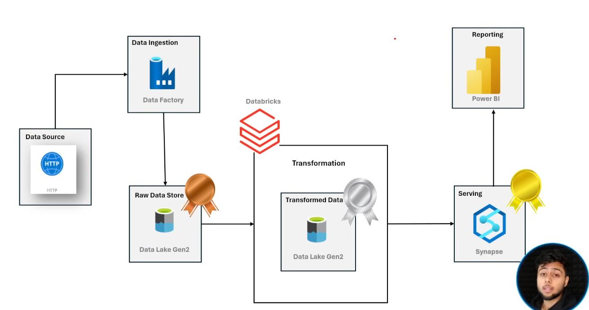
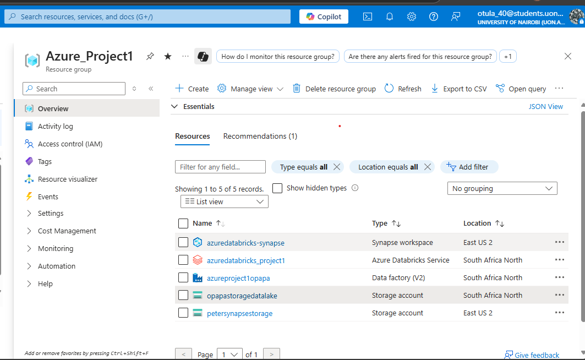
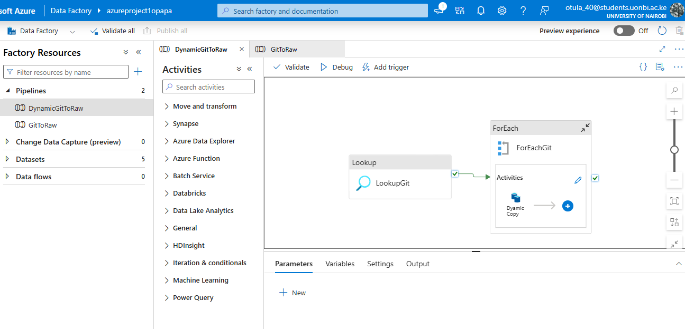
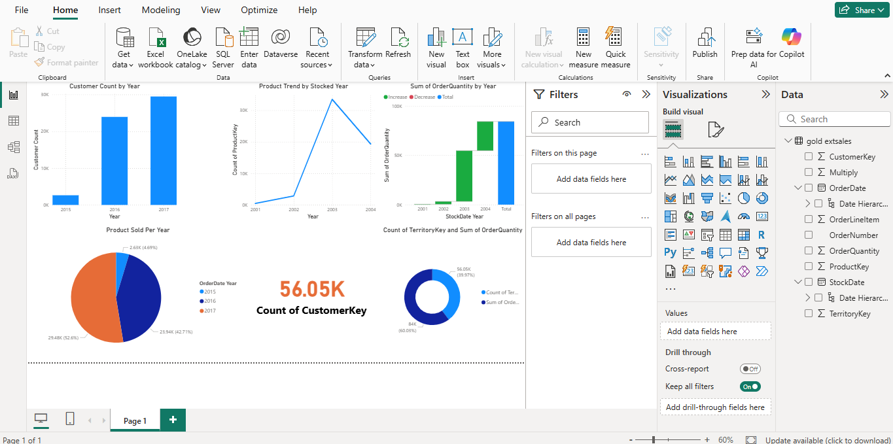

# 🌐 Azure Data Engineering Project: End-to-End Medallion Architecture

This project showcases a complete Azure-native data pipeline using the **Medallion Architecture (Bronze → Silver → Gold)** to ingest, transform, and visualize data using tools like **Azure Data Factory (ADF)**, **Databricks**, **Data Lake Gen2**, **Synapse**, and **Power BI**.

---

## 🧰 Technologies Used

| Layer             | Tools & Services                |
|------------------|---------------------------------|
| Ingestion         | Azure Data Factory (ADF)        |
| Storage           | Azure Data Lake Storage Gen2    |
| Processing        | Azure Databricks (PySpark)      |
| Data Modeling     | Delta Lake, Star Schema         |
| Serving           | Azure Synapse Analytics         |
| Visualization     | Power BI                        |

---

## 📁 Project Structure
```
azure-data-pipeline-project/
├── notebooks/ # Databricks Notebooks
│ ├── bronze_ingestion.ipynb
│ ├── silver_transformation.ipynb
│ ├── gold_serving.ipynb
│ └── parameters.ipynb
│
├── images/ # Architecture & Visuals
│ ├── architecture.png
│ ├── adf_pipeline_overview.png
│ ├── adf_linked_services.png
│ ├── adf_dataflows.png
│ └── adf_triggers.png
│
├── dashboards/
│ └── PowerBI_Report.pbix
│
├── scripts/
│ ├── synapse_table_creation.sql
│ └── adf_pipeline_definition.json
│
├── requirements.txt
└── README.md
```
---

---

## 🗺️ Project Architecture

### 🔧 Overview
The data pipeline follows a **Bronze → Silver → Gold** layered approach:

- **Bronze Layer**: Raw data landing using ADF from HTTP API to Data Lake.
- **Silver Layer**: Data cleansing and transformations in Databricks (PySpark).
- **Gold Layer**: Business-level curated tables modeled in Star Schema and stored in Synapse.
- **Dashboard**: Business reports and metrics built on Power BI.



---
## 🗺️ Resource Group Overview

A well-structured resource group was used for project deployment:


---

## 🛠️ Azure Data Factory (ADF) Pipelines
This project uses parameterized ADF pipelines to perform dynamic ingestion from multiple data sources. The pipeline is designed to scale by reading data definitions from a [JSON configuration](notebooks/git.json) file and looping over them.

🔁 Parameterization Logic
The pipeline follows this logic:

1. `Lookup` Activity:
    Reads ingestion parameters (e.g., source paths, target tables) from a JSON configuration file (git.json) stored in Git or Blob.

2. `ForEach` Activity:
    Iterates over each configuration object retrieved from the Lookup activity.

3. `Copy Data` Activity:
    Executes a dynamic copy operation based on the parameters provided for each object.
### 📂 Pipeline JSON Definition

You can explore the entire ADF pipeline definition by reviewing the [`adf_pipeline_definition.json`](scripts/dynamic_adf_pipeline.json) file located in the `/scripts` folder.


---

## 📊 Dashboard Preview (Power BI)
📂 File: [PowerBI Dashboard](dashboards/Azure_powerBI.pbix)


---
## 🧪 How to Run
   1. Open notebooks in Databricks and attach them to a cluster.

   2. Import ADF pipeline from JSON into Azure Data Factory.

   3. Run ingestion pipeline from ADF.

   4. Execute notebooks in order: bronze_ingestion → silver_transformation → gold_serving.

   5. Connect Power BI to Synapse and refresh the report.

---
