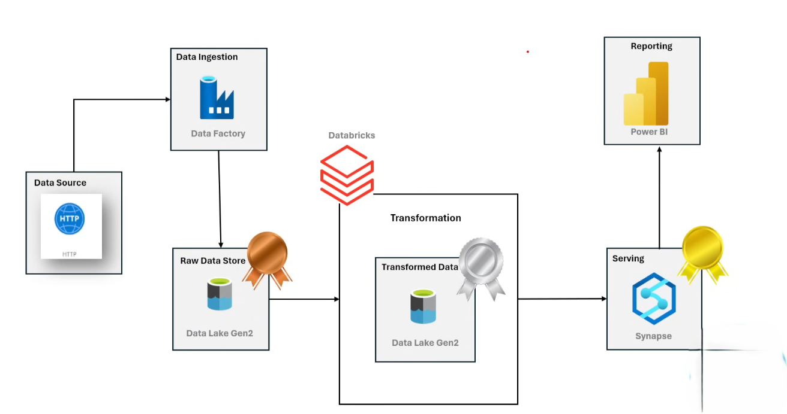

# Azure Data Engineering Project: Enterprise-Scale Medallion Architecture

## Overview

This comprehensive Azure data engineering solution demonstrates the implementation of a production-ready **Medallion Architecture (Bronze → Silver → Gold)** pattern. The project leverages Microsoft Azure's native cloud services to create a scalable, maintainable, and cost-effective data pipeline that processes AdventureWorks business data from ingestion through to business intelligence reporting.

## Business Context

The solution addresses common enterprise data challenges by implementing a robust ETL/ELT pipeline that:
- Ingests raw data from multiple sources in a parameterized, scalable manner
- Applies data quality controls and transformations using industry-standard practices
- Creates a curated data warehouse following dimensional modeling principles
- Delivers actionable business insights through interactive dashboards

---

## Technology Stack

| **Layer**         | **Azure Services**              | **Purpose**                     |
|-------------------|----------------------------------|---------------------------------|
| **Orchestration** | Azure Data Factory (ADF)        | Pipeline automation & scheduling |
| **Storage**       | Azure Data Lake Storage Gen2    | Scalable data lake storage      |
| **Processing**    | Azure Databricks (PySpark)      | Distributed data processing     |
| **Data Modeling** | Delta Lake, Dimensional Modeling | ACID transactions & star schema |
| **Analytics**     | Azure Synapse Analytics         | Enterprise data warehouse       |
| **Visualization** | Microsoft Power BI               | Business intelligence & reporting |

### Additional Components
- **Azure App Registration**: Service principal authentication
- **Azure Resource Group**: Centralized resource management
- **Git Integration**: Version control for pipeline configurations

---

## Repository Structure

```
azure-data-engineering-project/
├── 📄 README.md                           # Project documentation
├── 📄 requirements.txt                    # Python dependencies
├── 📄 *.pdf                              # Azure documentation references
│
├── 📁 notebooks/                          # Data processing notebooks
│   ├── Silver_Layer.ipynb                # Data transformation logic
│   └── git.json                          # Pipeline configuration parameters
│
├── 📁 scripts/                           # Infrastructure & SQL scripts
│   ├── dynamic_adf_pipeline.json         # ADF pipeline definition
│   ├── synapse_external_table_creation.sql # External table schemas
│   └── synapse_gold_views_creation.sql   # Business layer views
│
├── 📁 images/                            # Architecture diagrams & visuals
│   ├── Project-Architecture.png          # Solution overview
│   ├── dynamic_adf_pipeline.png          # Pipeline visualization
│   ├── Power_BI_image.png               # Dashboard preview
│   └── resources.png                     # Azure resource group
│
└── 📁 dashboards/                        # Business intelligence assets
    └── Azure_powerBI.pbix                # Power BI report template
```

---

## Solution Architecture

### Architecture Overview
The solution implements a modern **Medallion Architecture** pattern, providing a systematic approach to data processing through three distinct layers:

#### 🥉 **Bronze Layer (Raw Data Zone)**
- **Purpose**: Ingestion and storage of raw data in its original format
- **Technology**: Azure Data Factory with dynamic parameterization
- **Data Source**: AdventureWorks CSV files from GitHub repository
- **Storage**: Azure Data Lake Storage Gen2 (Bronze container)
- **Format**: CSV files with original structure preserved

#### 🥈 **Silver Layer (Cleansed Data Zone)**
- **Purpose**: Data quality, validation, and standardization
- **Technology**: Azure Databricks with PySpark processing
- **Transformations**: Schema validation, data type casting, null handling
- **Storage**: Delta Lake format for ACID compliance
- **Output**: Cleansed and validated datasets ready for modeling

#### 🥇 **Gold Layer (Business Data Zone)**
- **Purpose**: Business-ready analytical datasets
- **Technology**: Azure Synapse Analytics with T-SQL views
- **Data Model**: Star schema with dimension and fact tables
- **Storage**: Optimized for analytical workloads and BI tools
- **Consumers**: Power BI dashboards and analytical applications



### Data Flow Process
1. **Ingestion**: ADF pipelines read configuration from `git.json` and dynamically ingest multiple CSV files
2. **Processing**: Databricks notebooks apply transformations and quality checks
3. **Modeling**: Synapse Analytics creates dimensional views for business consumption
4. **Visualization**: Power BI connects to Synapse for interactive reporting

---
## Azure Resource Group

The solution is deployed within a well-organized Azure Resource Group that demonstrates best practices for cloud resource management:


### Key Resources Deployed:
- **Data Factory**: Orchestration and pipeline management
- **Storage Account**: Data Lake Gen2 with hierarchical namespace
- **Databricks Workspace**: Spark-based data processing environment
- **Synapse Workspace**: Enterprise data warehouse and analytics
- **App Registration**: Service principal for secure authentication

---

## Data Factory Pipeline Implementation

### Dynamic Pipeline Architecture
The solution features a sophisticated **parameterized ADF pipeline** designed for scalability and maintainability. This approach eliminates the need for creating multiple static pipelines by implementing a configuration-driven ingestion pattern.

#### Pipeline Components

##### 1. **Lookup Activity**
- Reads ingestion parameters from the [`git.json`](notebooks/git.json) configuration file
- Contains metadata for each dataset including source URLs, target folders, and file names
- Enables easy addition of new data sources without pipeline modification

##### 2. **ForEach Activity**
- Iterates over each configuration object retrieved from the Lookup activity
- Provides parallel processing capabilities for multiple datasets
- Implements error handling and retry logic

##### 3. **Copy Data Activity**
- Executes dynamic copy operations based on configuration parameters
- Supports various source and sink types
- Includes data validation and error handling

#### Configuration Management
The pipeline leverages a JSON configuration file that defines:
```json
{
    "p_relative_url": "source/path/to/data.csv",
    "p_sink_folder": "target_folder_name",
    "p_sink_file": "target_file_name.csv"
}
```

#### Pipeline Benefits
- **Scalability**: Add new data sources by updating configuration file only
- **Maintainability**: Single pipeline handles multiple data sources
- **Reliability**: Built-in retry logic and error handling
- **Monitoring**: Centralized logging and pipeline monitoring

### Pipeline Visualization


**Technical Implementation**: The complete pipeline definition is available in [`dynamic_adf_pipeline.json`](scripts/dynamic_adf_pipeline.json)

---

## Business Intelligence Dashboard

### Power BI Implementation
The solution delivers business value through a comprehensive Power BI dashboard that provides actionable insights from the processed AdventureWorks data.

#### Dashboard Features
- **Interactive Visualizations**: Dynamic charts and graphs for data exploration
- **Key Performance Indicators**: Critical business metrics and KPIs
- **Drill-down Capabilities**: Ability to analyze data at various granular levels
- **Real-time Data**: Direct connection to Synapse for up-to-date reporting

#### Technical Integration
- **Data Source**: Azure Synapse Analytics Gold layer views
- **Refresh Schedule**: Configurable automatic data refresh
- **Security**: Row-level security implementation ready
- **Performance**: Optimized queries and data model for fast rendering

### Dashboard Preview


**Artifact Location**: [`Azure_powerBI.pbix`](dashboards/Azure_powerBI.pbix)

---
## Implementation Guide

### Prerequisites
- Azure subscription with appropriate permissions
- Azure Data Factory, Databricks, Synapse Analytics, and Power BI licenses
- Basic understanding of Azure services and data engineering concepts

### Deployment Steps

#### 1. **Environment Setup**
   - Create Azure Resource Group
   - Deploy required Azure services (Data Factory, Storage Account, Databricks, Synapse)
   - Configure service principal authentication
   - Set up proper IAM roles and permissions

#### 2. **Data Factory Configuration**
   - Import pipeline definition from [`dynamic_adf_pipeline.json`](scripts/dynamic_adf_pipeline.json)
   - Configure linked services for source and destination
   - Update connection strings and authentication settings
   - Test pipeline connectivity

#### 3. **Data Processing Setup**
   - Import [`Silver_Layer.ipynb`](notebooks/Silver_Layer.ipynb) into Databricks workspace
   - Attach notebook to appropriate Databricks cluster
   - Update storage account configuration in notebook
   - Validate data transformation logic

#### 4. **Data Warehouse Preparation**
   - Execute scripts in Synapse Analytics:
     - [`synapse_external_table_creation.sql`](scripts/synapse_external_table_creation.sql)
     - [`synapse_gold_views_creation.sql`](scripts/synapse_gold_views_creation.sql)
   - Verify external table connectivity
   - Test view performance and accuracy

#### 5. **Pipeline Execution**
   - Execute ADF pipeline to ingest Bronze layer data
   - Run Databricks notebook for Silver layer transformations
   - Validate Gold layer views in Synapse
   - Monitor execution logs and performance metrics

#### 6. **Business Intelligence Setup**
   - Import [`Azure_powerBI.pbix`](dashboards/Azure_powerBI.pbix) into Power BI workspace
   - Configure connection to Synapse Analytics
   - Refresh data model and validate visualizations
   - Set up scheduled refresh if required

### Monitoring and Maintenance
- **Pipeline Monitoring**: Use ADF monitoring dashboard for pipeline execution tracking
- **Data Quality**: Implement data validation checks in Silver layer processing
- **Performance Optimization**: Monitor query performance in Synapse and optimize as needed
- **Cost Management**: Review resource utilization and optimize compute resources

---

## Project Outcomes

This implementation demonstrates:
- **Scalable Architecture**: Handles growing data volumes through cloud-native scaling
- **Best Practices**: Follows industry standards for data engineering and cloud architecture
- **Cost Efficiency**: Leverages serverless and auto-scaling capabilities
- **Business Value**: Delivers actionable insights through professional BI dashboards
- **Maintainability**: Configuration-driven approach reduces operational overhead

---

## Additional Resources

### Documentation References
- [Azure Data Factory Documentation](azure-data-factory-documentation.pdf)
- [Azure Synapse Analytics Guide](azure-synapse-analytics-documentation.pdf)
- [Stream Analytics Query Reference](stream-analytics-query-documentation.pdf)
- [Azure Tools for Data Engineers](Azure_Tools_for_Data_Engineers_Guide.pdf)

### Dependencies
```
pyspark>=3.0.0
delta-spark>=2.0.0
azure-storage-blob>=12.0.0
```

---

